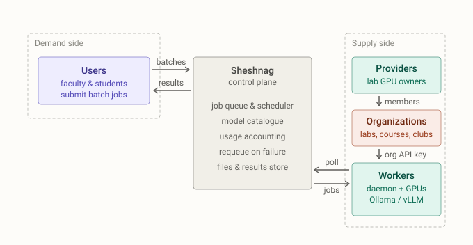

  

<h3 align="center">Turn your institution's scattered, idle GPUs into one shared AI batch platform.</h3>

  
  
  
  

---

Institutional GPUs are bought per-project and per-lab. They sit behind lab doors,
idle most of the week, usable only by whoever owns the box — while the next
researcher who needs a weekend of inference is told to wait for a budget cycle.

Sheshnag is the sharing layer. It pools idle GPUs from researchers and labs and
schedules asynchronous batch AI inference jobs on them. Users submit OpenAI-style
JSONL batches through a dashboard or API; organizations host GPU workers by running
a lightweight daemon; the control plane validates, schedules, tracks, and returns
results.

It is **software you host**, not a service you sign up for.

  

## Why Sheshnag?

**Pool the hardware you already own.** A GPU machine joins with one command,
about ten minutes, no repository clone and no `sudo`. The daemon *pulls* work, so
it runs behind NAT and lab firewalls with no inbound ports. Machines may leave
whenever their owner wants them back: a worker that stops heartbeating is
presumed dead after 120 seconds, and its in-flight batch is automatically
requeued on another one. Lending a GPU costs its owner nothing.

**Your existing batch code mostly runs unchanged.** Sheshnag speaks the OpenAI
batch shape — upload a JSONL of prompts, submit a batch, poll it, download
results — so migrating is largely a matter of changing `base_url`. "Largely" is
doing real work in that sentence: which sampling parameters each runtime honours,
translates, ignores, or rejects is written down, per parameter, in the
[OpenAI compatibility matrix](docs/reference/openai-compatibility.md). Read it
before you promise anything to your users.

**The institution stays in charge.** Every servable model is a pinned artifact —
weights, quantization and runtime, matched to workers by digest — so nothing
uncatalogued executes. Users, labs and courses are separate organizations with
their own roles and revocable API keys, and token usage is attributed per
organization and per model. Allocation policy stops being a paper document.

## How it works

1. A **user** uploads a JSONL batch. The control plane validates it against the
   model catalogue and queues it.
2. An **organization's workers** — any Linux GPU box running the daemon — poll for
   jobs they can serve, advertising their GPUs, runtimes, models and VRAM headroom
   on every heartbeat.
3. A worker executes the batch on **Ollama or vLLM** and uploads results; the user
   downloads them. If the worker disappears mid-job, the batch is requeued
   (terminal failure only after three attempts).

## Get started — pick your role

Each guide reads front to back, once.

| You want to… | Read | Roughly |
|---|---|---|
| **Submit jobs** to a deployment someone else runs | [Run your prompts](docs/using-sheshnag.md) | swap `base_url`, submit, poll, download |
| **Lend a GPU** to a deployment | [Lend your GPU](docs/provider.md) | one command, 10 minutes, no clone, no sudo |
| **Run Sheshnag** for your institution | [Host your deployment](docs/self-host.md) | an afternoon — Postgres, TLS, first provider |
| **Change the code** | [Work on Sheshnag](docs/develop.md) | three services locally, tests green |

Evaluating Sheshnag for an institution and want a hand standing up a pilot?
[Open an issue](https://github.com/gamekeepers/sheshnag/issues/new) — at this
stage we would rather support a few deployments properly than watch many fail
quietly.

## Components

| Component | Path | Stack | Docs |
|---|---|---|---|
| Control plane (API) | [`backend/`](backend/) | FastAPI + Postgres | [API reference](docs/reference/api.md) |
| Worker daemon | [`daemon/`](daemon/) | Python, Ollama/vLLM runtimes | [Daemon internals](docs/reference/daemon.md) |
| Dashboard | [`app/`](app/) | Next.js | [Work on Sheshnag](docs/develop.md) |
| Documentation site | [`docs/`](docs/) | MkDocs → [sheshnag.io](https://sheshnag.io) | [Reference](docs/reference/) |

## Status

**Pilot.** Sheshnag is being deployed on institutional hardware and is in active
development, so expect rough edges. Every reference page carries the date it was
last checked against the code, and says so when that check is overdue — trust the
code over the prose. Three subprojects are underway:

- **Scheduler** — VRAM- and model-affinity-aware scheduling across a heterogeneous pool.
- **Resumability** — checkpointing, so an interrupted batch loses no completed work.
- **Forge** — finetuning as a service: upload a dataset, get LoRA weights back.

Open work lives in [issues](https://github.com/gamekeepers/sheshnag/issues).

## Documentation

The docs are a [MkDocs](https://www.mkdocs.org/) site under [`docs/`](docs/),
routed by audience and published to [sheshnag.io](https://sheshnag.io); each
deployment also serves its own copy at `/docs/`. To build or preview it locally,
see [Work on Sheshnag](docs/develop.md#conventions) — and run
`mkdocs build --strict` before opening a PR that touches `docs/`, which is what CI
runs.

## Contributing

Start with [CONTRIBUTING.md](CONTRIBUTING.md) — the branching model, review rules
and who merges. Security issues go through [SECURITY.md](SECURITY.md), not the
issue tracker.

## Licence

Apache License 2.0 — see [`LICENSE`](LICENSE).
