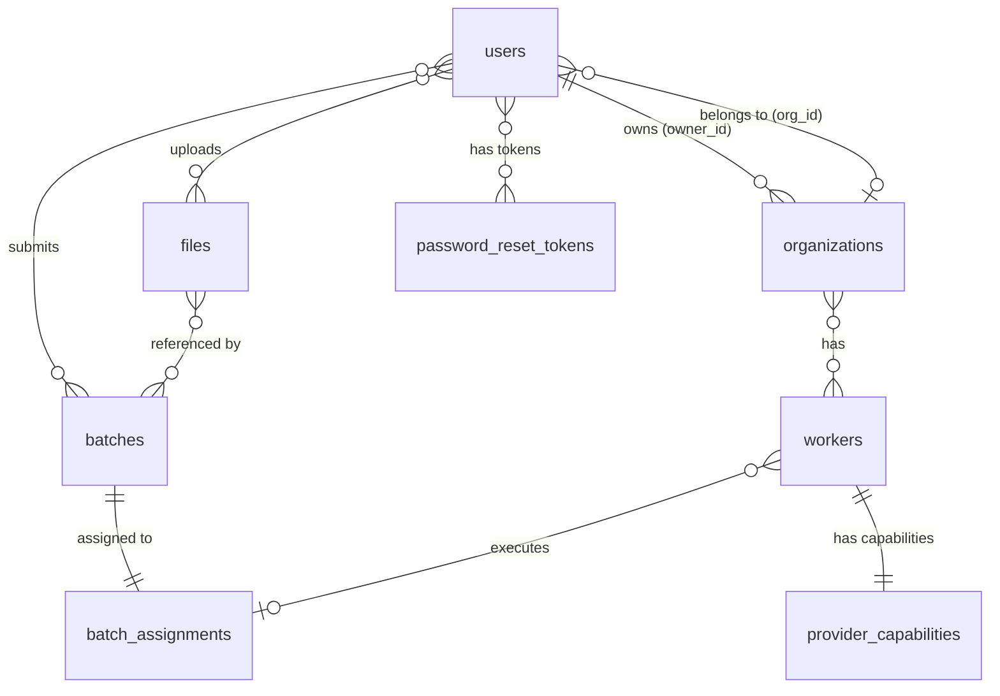

# Database Schema

## Overview

- **Engine:** SQLite (`backend/jobs.db`)
- **ORM:** SQLAlchemy 2.x (sync, `DeclarativeBase`)
- **Migrations:** None — schema is auto-created on startup via `Base.metadata.create_all()`. To reset, delete `jobs.db` and restart the backend.
- **Timestamps:** Stored as Unix epoch integers (`int`) in UTC via shared helper `unix_now()`.
- **IDs:** Domain-prefixed UUIDs generated by dedicated helpers (e.g. `user-*`, `org-*`, `worker-*`, `file-*`, `batch-*`).

---

## Tables

### `users`

| Column | Type | Constraints | Default |
|---|---|---|---|
| `id` | `String` | PK | `user-{uuid4 hex[0:24]}` |
| `email` | `String` | Unique, Not Null | — |
| `password_hash` | `String` | Not Null | — |
| `full_name` | `String` | Not Null | — |
| `role` | `String` | Not Null | — |
| `org_id` | `String` | Nullable | `NULL` |
| `api_key` | `String` | Unique, Nullable | `NULL` |
| `is_active` | `Boolean` | — | `True` |
| `must_change_password` | `Boolean` | — | `False` |
| `created_at` | `Integer` | — | Unix now (UTC) |

**Description:** Application users. A default admin (`admin@platform.com`) is created on startup. Optional API key (`gk-*` prefix) for programmatic access.

---

### `organizations`

| Column | Type | Constraints | Default |
|---|---|---|---|
| `id` | `String` | PK | `org-{uuid4 hex[0:24]}` |
| `name` | `String` | Not Null | — |
| `owner_id` | `String` | Not Null | — |
| `created_at` | `Integer` | — | Unix now (UTC) |

**Description:** Tenant organizations. Links to the owning user via `owner_id` (implicit FK to `users.id`, no database constraint). Users belong to an org through their `org_id`.

---

### `workers`

| Column | Type | Constraints | Default |
|---|---|---|---|
| `id` | `String` | PK | `worker-{uuid4 hex[0:24]}` |
| `provider_id` | `String` | Not Null | — |
| `org_id` | `String` | Not Null | — |
| `hostname` | `String` | Not Null | — |
| `os` | `String` | Nullable | `NULL` |
| `cpu_cores` | `Integer` | Nullable | `NULL` |
| `ram_total_gb` | `Float` | Nullable | `NULL` |
| `gpus` | `Text` | — | `"[]"` |
| `runtimes` | `Text` | — | `"[]"` |
| `status` | `String` | — | `"online"` |
| `last_heartbeat` | `Integer` | — | Unix now (UTC) |
| `created_at` | `Integer` | — | Unix now (UTC) |

**Description:** GPU worker nodes managed by the daemon. `gpus` and `runtimes` store JSON arrays as text. Status is updated via heartbeat from the daemon. `org_id` links to `organizations.id` (implicit FK).

---

### `files`

| Column | Type | Constraints | Default |
|---|---|---|---|
| `id` | `String` | PK | `file-{uuid4 hex[0:24]}` |
| `user_id` | `String` | Nullable | `NULL` |
| `filename` | `String` | Not Null | — |
| `purpose` | `String` | — | `"batch"` |
| `bytes` | `Integer` | — | `0` |
| `filepath` | `String` | Not Null | `""` |
| `created_at` | `Integer` | — | Unix now (UTC) |

**Description:** Uploaded files used as batch inputs, completion outputs, or error logs. Referenced by `batches.input_file_id`, `batches.output_file_id`, and `batches.error_file_id`.

---

### `batches`

| Column | Type | Constraints | Default |
|---|---|---|---|
| `id` | `String` | PK | `batch-{uuid4 hex[0:24]}` |
| `user_id` | `String` | Nullable | `NULL` |
| `endpoint` | `String` | Not Null | — |
| `model` | `String` | Nullable | `NULL` |
| `input_file_id` | `String` | Not Null | — |
| `completion_window` | `String` | — | `"24h"` |
| `status` | `String` | — | `"validating"` |
| `output_file_id` | `String` | Nullable | `NULL` |
| `error_file_id` | `String` | Nullable | `NULL` |
| `created_at` | `Integer` | — | Unix now (UTC) |
| `expires_at` | `Integer` | Nullable | `NULL` |
| `requested_at` | `Integer` | Nullable | `NULL` |
| `completed_at` | `Integer` | Nullable | `NULL` |
| `request_counts_total` | `Integer` | — | `0` |
| `request_counts_completed` | `Integer` | — | `0` |
| `request_counts_failed` | `Integer` | — | `0` |
| `error_details` | `String` | Nullable | `NULL` |

**Description:** Batch inference jobs. Status lifecycle: `validating` → `queued` → `in_progress` → `completed` / `expired` / `failed`. Request counts track per-batch success/failure breakdown. Timestamps for expiration and state transitions are optional until populated.

---

### `batch_assignments`

| Column | Type | Constraints | Default |
|---|---|---|---|
| `batch_id` | `String` | PK | — |
| `worker_id` | `String` | Not Null | — |
| `assigned_at` | `Integer` | — | Unix now (UTC) |

**Description:** Links a batch to the worker assigned to execute it. One row per batch — `batch_id` is the sole primary key, enforcing a single assignment. Implicit FKs to `batches.id` and `workers.id`.

---

### `provider_capabilities`

| Column | Type | Constraints | Default |
|---|---|---|---|
| `worker_id` | `String` | PK | — |
| `provider_id` | `String` | Not Null | — |
| `vram_total_gb` | `Float` | — | `0` |
| `vram_available_gb` | `Float` | — | `0` |
| `loaded_models` | `String` | — | `"[]"` |
| `status` | `String` | — | `"online"` |
| `last_heartbeat` | `Integer` | — | Unix now (UTC) |

**Description:** Per-provider capability snapshot per worker (e.g. vLLM, Ollama). Tracks VRAM availability and currently loaded models for the provider picker. One row per worker (`worker_id` is PK). Implicit FK to `workers.id`.

---

### `password_reset_tokens`

| Column | Type | Constraints | Default |
|---|---|---|---|
| `id` | `String` | PK | — |
| `user_id` | `String` | Not Null | — |
| `token` | `String` | Unique, Not Null | — |
| `expires_at` | `Integer` | Not Null | — |
| `used` | `Boolean` | — | `False` |
| `created_at` | `Integer` | — | Unix now (UTC) |

**Description:** One-time password reset tokens. A token becomes invalid after use (`used = True`) or when the current time exceeds `expires_at`. Implicit FK via `user_id` to `users.id`.

---

## Relationship Map

## Foreign Key Notes

All foreign keys are **implicit** — maintained at the application level only. No `ForeignKey` constraints are defined in SQLAlchemy models and no database-level FK enforcement is enabled in SQLite. This means:

- Orphaned rows can exist if records are deleted without cleanup.
- The routers/services layer handles referential integrity through queries and deletes before cascading.
- Adding explicit constraints would require schema changes and migration strategy (currently none).
